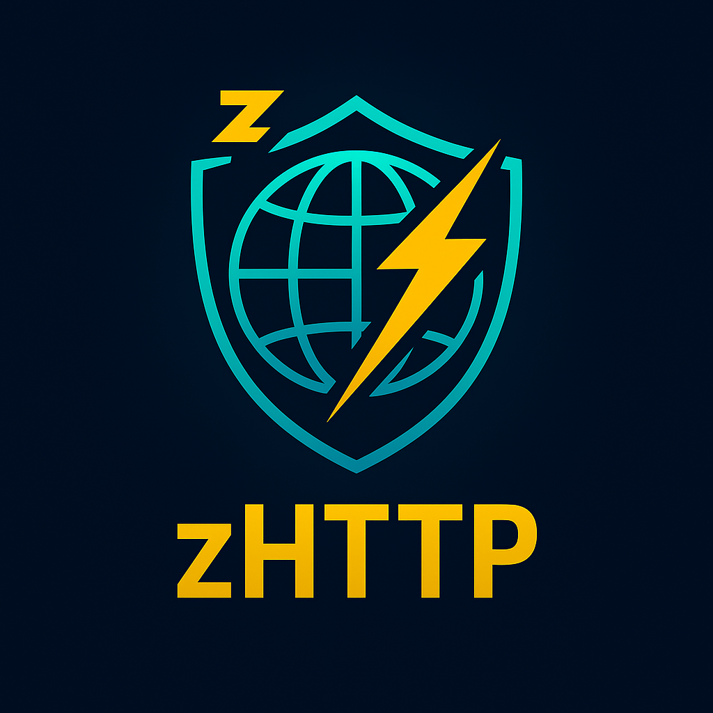

<div align="center">
  
</div>

# 🚀 zhttp

[](https://ziglang.org/)
[](LICENSE)
[](https://github.com/ghostkellz/zhttp)
[](DOCS.md)

A modern, fast, and feature-rich HTTP client library for Zig with TLS support, connection pooling, and an intuitive API.

## ✨ Features

- 🌐 **HTTP/1.1 Support** - Full HTTP/1.1 protocol implementation
- 🔒 **TLS/SSL** - Built-in TLS support with certificate verification
- 🏊 **Connection Pooling** - Efficient connection reuse and management
- 📦 **Request/Response Builders** - Fluent API for building requests
- 🔧 **Header Management** - Comprehensive HTTP header utilities
- 📝 **Body Handling** - Support for text, JSON, binary, and multipart data
- ⚡ **Async Ready** - Built with Zig's async model in mind
- 🛡️ **Memory Safe** - Proper memory management with allocator patterns
- 🔄 **Retry Logic** - Configurable retry mechanisms with exponential backoff
- 📊 **Progress Tracking** - Download progress monitoring
- 🎯 **Zero Dependencies** - Uses only Zig's standard library

## 🚀 Quick Start

### Installation

Add zhttp to your project using Zig's package manager:

```bash
zig fetch --save https://github.com/ghostkellz/zhttp
```

### Basic Usage

```zig
const std = @import("std");
const zhttp = @import("zhttp");

pub fn main() !void {
    var gpa = std.heap.GeneralPurposeAllocator(.{}){};
    defer _ = gpa.deinit();
    const allocator = gpa.allocator();

    // Simple GET request
    var response = try zhttp.get(allocator, "https://api.github.com/users/octocat");
    defer response.deinit();

    if (response.isSuccess()) {
        const body = try response.text(1024 * 1024);
        defer allocator.free(body);
        std.debug.print("Response: {s}\n", .{body});
    }
}
```

### Advanced Usage

```zig
// Create a client with custom options
var client = zhttp.Client.init(allocator, .{
    .connect_timeout = 10000,
    .max_redirects = 5,
    .user_agent = "MyApp/1.0",
});
defer client.deinit();

// Build a complex request
const request = zhttp.RequestBuilder.init(allocator, .POST, "https://api.example.com/data")
    .header("Authorization", "Bearer token123")
    .header("Content-Type", "application/json")
    .json(.{ .name = "John", .age = 30 })
    .timeout(30000)
    .build();

var response = try client.send(request);
defer response.deinit();
```

## 📚 Documentation

- **[API Reference](API.md)** - Complete API documentation
- **[Integration Guide](INTEGRATION.md)** - How to integrate zhttp into your projects
- **[Documentation](DOCS.md)** - Architecture, features, and examples

## 🔧 Configuration

```zig
const options = zhttp.ClientOptions{
    .connect_timeout = 10000,      // Connection timeout (ms)
    .read_timeout = 30000,         // Read timeout (ms)
    .max_redirects = 10,           // Maximum redirects to follow
    .max_retries = 3,              // Maximum retry attempts
    .user_agent = "zhttp/1.0.0",   // User agent string
    .pool = .{
        .max_per_host = 10,        // Max connections per host
        .max_total = 100,          // Max total connections
    },
    .tls = .{
        .verify_certificates = true, // Enable certificate verification
        .min_version = .tls_1_2,     // Minimum TLS version
    },
};
```

## 📋 Examples

### JSON API Integration

```zig
const User = struct { id: u32, name: []const u8, email: []const u8 };

// GET JSON data
var response = try client.send(
    zhttp.RequestBuilder.init(allocator, .GET, "https://api.example.com/users/1")
        .header("Accept", "application/json")
        .build()
);
defer response.deinit();

const user = try response.json(User, 1024);
```

### File Upload

```zig
var multipart = zhttp.MultipartBody.init(allocator);
defer multipart.deinit();

try multipart.addFile("file", "document.pdf", zhttp.Body.fromFile("./document.pdf"), "application/pdf");
try multipart.addField("description", "Important document");

const request = zhttp.RequestBuilder.init(allocator, .POST, "https://api.example.com/upload")
    .body(zhttp.Body{ .multipart = multipart })
    .build();
```

### Download with Progress

```zig
var response = try zhttp.get(allocator, "https://example.com/large-file.zip");
defer response.deinit();

const file = try std.fs.cwd().createFile("download.zip", .{});
defer file.close();

var buffer: [8192]u8 = undefined;
var total_read: usize = 0;
const content_length = response.contentLength() orelse 0;

while (true) {
    const bytes_read = try response.body_reader.read(&buffer);
    if (bytes_read == 0) break;
    
    try file.writeAll(buffer[0..bytes_read]);
    total_read += bytes_read;
    
    const progress = (@as(f64, @floatFromInt(total_read)) / @as(f64, @floatFromInt(content_length))) * 100.0;
    std.debug.print("\rProgress: {d:.1}%", .{progress});
}
```

## 🏗️ Requirements

- **Zig 0.16.0-dev** or later
- **TLS Support** - Uses Zig's built-in TLS implementation
- **Network Access** - Requires network connectivity for HTTP requests

## 🧪 Testing

Run the test suite:

```bash
zig build test
```

Run examples:

```bash
zig build run-example
```

## 🤝 Contributing

Contributions are welcome! Please see our [TODO.md](TODO.md) for a list of planned features and known issues.

### Development Setup

```bash
git clone https://github.com/ghostkellz/zhttp.git
cd zhttp
zig build test
```

## 📄 License

This project is licensed under the MIT License - see the [LICENSE](LICENSE) file for details.

## 🙏 Acknowledgments

- Inspired by modern HTTP client libraries  
- Thanks to the Zig community for feedback and contributions

---

**Made with Zig** 🦎
